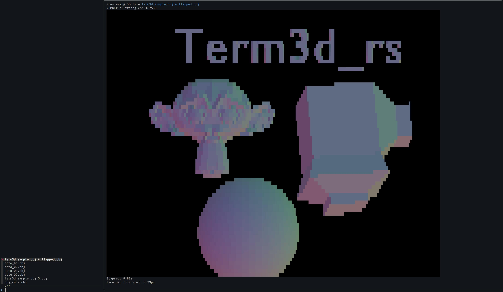

# term3d_rs
View 3D models in the terminal.

```bash
> cargo run --release [OBJ-file-name]

```

 and the 3D editor blender (right)")

The idea is to have a representation of the gemometry of a 3D model in the terminal. The resolution is limited, but might be sub-character with the use of baile characters. 24-bit color characters are necessary to represent the orientation of the surfaces of the model.

## Status

The aspect ratio of the terminal characters are not taken into account. This is currently set in code.

Currently also writes into a PPM file. Example output:
 and the 3D editor blender (below)")

## Why

This is intended to provide previews of 3D files in the terminal. Having the wonderful `https://github.com/junegunn/fzf` call term3d_rs encapulates the use case quite nicely:
```bash
fzf --preview 'cargo run --release  0 {}' --preview-window=right,80%
```


## To export from blender as OBJ use these settings

Under Transform:
* Forward: -Z Forward
* Up: -X Up

Under Geometry:
* Triangulate Faces
